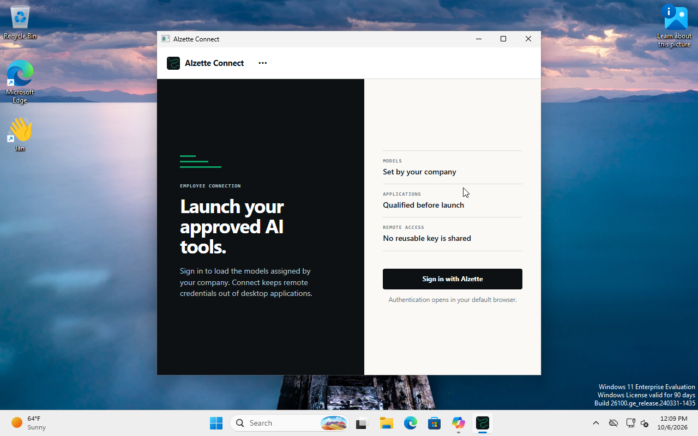
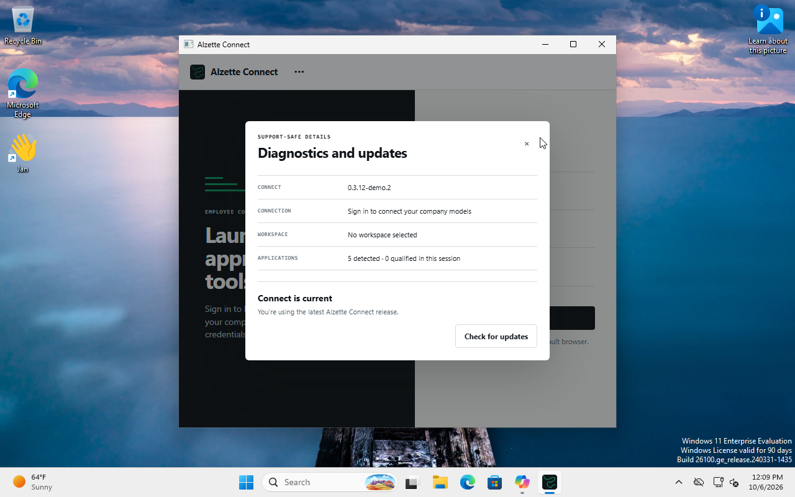

# Windows installer acceptance — 0.3.12-demo.2

The exact published unsigned installer was built from
`7058b882bb7f06e7391c236feb245dc8f3159d8c` on the Windows CI runner.
Its SHA-256 is
`ca62ead4e3f544e9e3ada4687b946e89c2a000b4e10f84b92c1baa0d296205c7`.

The Windows QA VM passed:

- per-user silent upgrade from `0.3.12-demo.1`, with no automatic application
  launch and no changes to ChatGPT or Claude profiles;
- installed application startup, five detected clients and the correct
  `0.3.12-demo.2` version in Diagnostics;
- Windows GUI subsystem verification and startup without a debug console;
- successful credential-helper output from the installed GUI executable,
  using a disposable Windows Credential Manager entry and an authenticated
  loopback fixture; cleanup and rejection of the deleted entry also passed;
- normal application quit, silent reinstall, and uninstall that removed the
  application and its registration while preserving client profiles and
  external user data.

The installer checksum and GitHub build-provenance attestation were verified.
The source CI run also passed on Windows, macOS and Linux. See
[qualification.json](qualification.json), [installation](install-report.json),
[helper qualification](helper-report.json), [reinstall](reinstall-report.json),
[uninstall](uninstall-report.json), and
[provenance verification](attestation-verification.json).

The installer smoke script is retained as [installer-smoke.ps1](installer-smoke.ps1).
The helper fixture source is [credential-helper-check.go.txt](credential-helper-check.go.txt).
Compile that source as a Windows executable and run it from the interactive
Windows desktop with the installed Connect executable as its argument.
An SSH service logon does not provide the interactive user's Credential Manager
session. No employee credential or paid inference is used by this fixture.

Live inference was not repeated for this packaging check. Prior ChatGPT and
Claude Code/Cowork qualification remains in the separately scoped
[acceptance matrix](../../DESKTOP_PARITY.md) and
[Claude evidence](../windows-claude-deepseek-2026-10-06/README.md).
